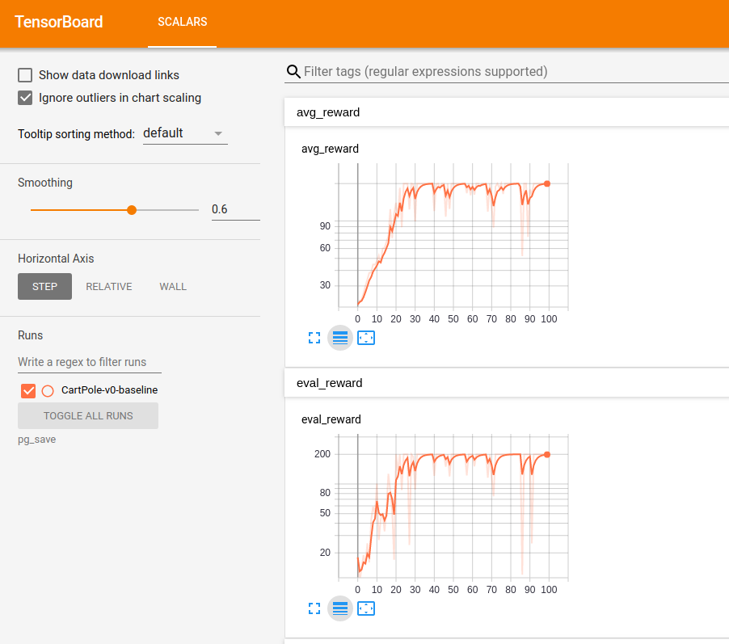
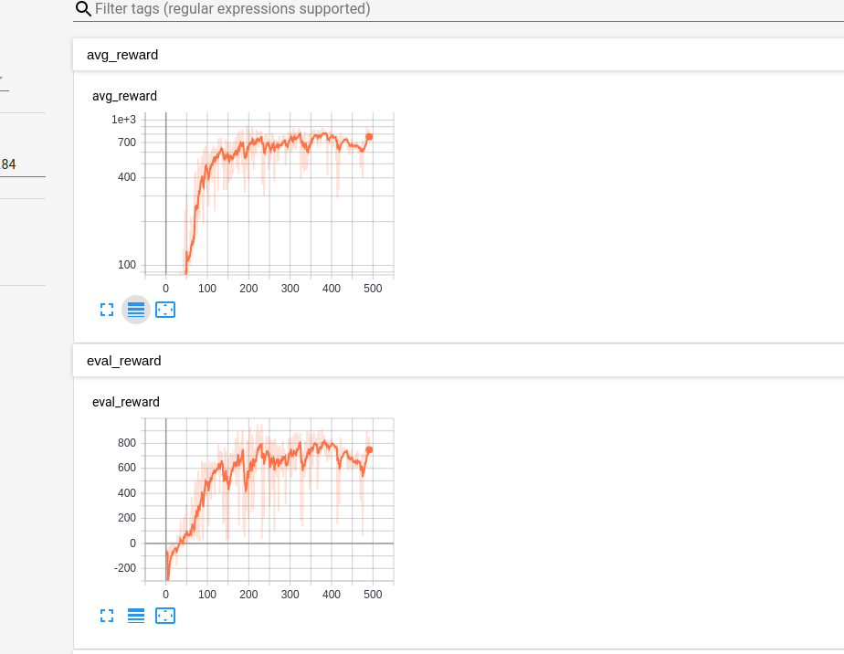

# Reinforcement Learning Toys
一些常见强化学习算法简单代码实现。工程应用请使用 [OpenAi baselines](https://github.com/openai/baselines)  
## 运行要求
- Python 3.X
- 安装gym, mujoco [详见:gym](https://github.com/openai/gym)
- 安装pytorch, [详见:pytorch](https://pytorch.org/)

## 基于值函数的动态规划算法
在模型已知且动作空间离散、状态空间离散的情况下，动态规划算法可以解决强化学习问题。其中算法包括策略迭代算法与值迭代算法。vi_and_pi.py中实现了这两个算法。
- 运行策略迭代算法
    ```shell
    $ cd RL-toys
    $ python vi_and_pi.py --policy
    ```
- 运行值迭代算法
    ```shell
    $ cd RL-toys
    $ python vi_and_pi.py --value
    ```
## 策略梯度算法
- 训练策略网络
    ```shell
    $ cd RL-toys
    $ python pg.py --train
    ```
- 查看训练过程中每个batch回报值变化
    ```shell
    $ tensorboard --logdir=save/pg/
    ```
    可在网页中看到每个batch的平均回报、最大回报等数据：  

      

- 测试训练好的模型
    ```shell
    $ python pg.py --test
    ```

## PPO
PPO比较稳，但不一定效果最好。
-  在Ant-v2环境中训练PPO
    ```shell
    $ cd RL-toys
    $ python ppo.py --train --env Ant-v2
    ```
     
- 查看训练过程中每个batch回报值变化
    ```shell
    $ tensorboard --logdir=save/ppo/Ant-v2/
    ```

     
-  测试训练好的模型
    ```shell
    $ cd RL-toys
    $ python ppo.py --test --env Ant-v2
    ```

